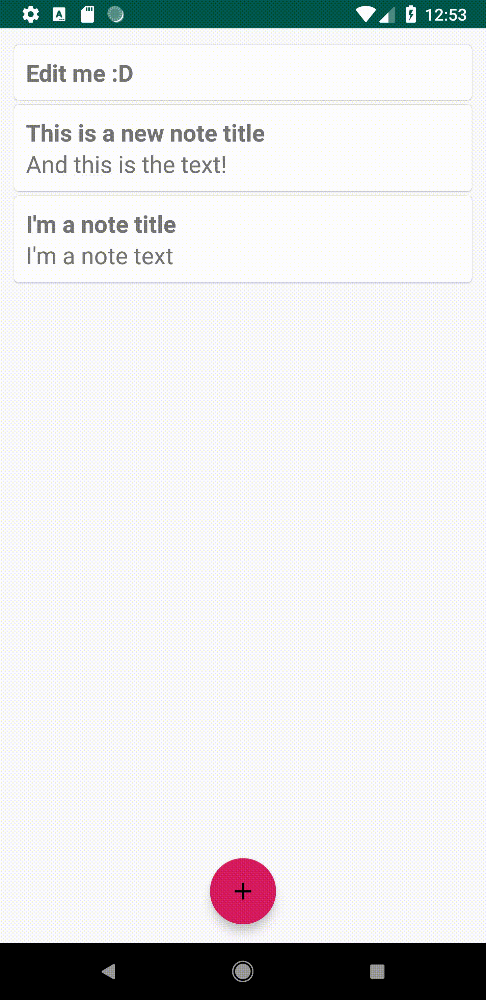

# Notes
> Create and store your notes for a later purpose!

## Features
* Create a note

* Edit a note

* Delete a note

* All notes are stored in a database and wont be deleted when closing the app

## Motivation
I've built this simple note-taking app to get started with android development